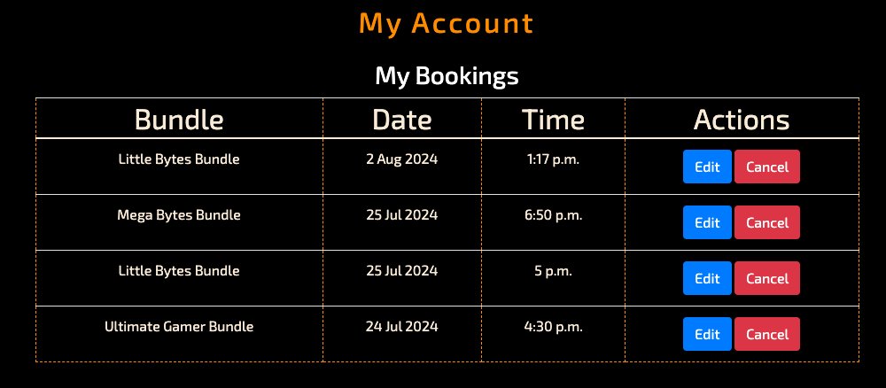
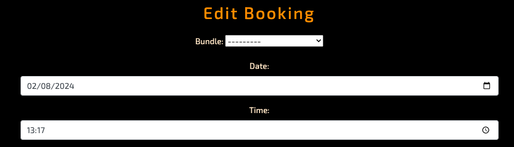
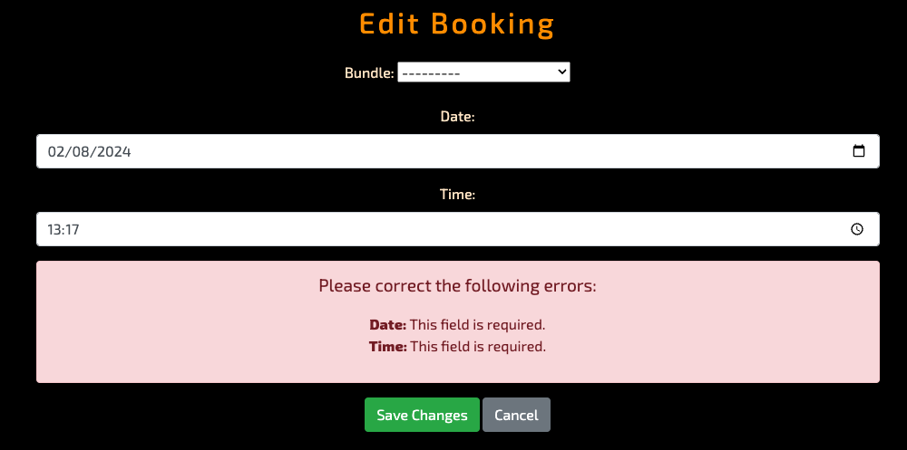
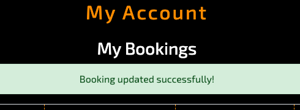
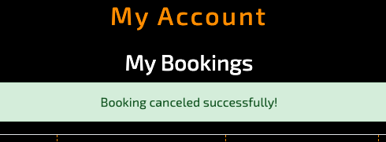
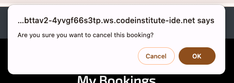

# Additions
Code Institute PP04 Resub

This is a document of all my updated changes to try to meet the requirements of the resubmission of my project. This resub is capped at a pass so I have only made steps to fix issues in the pass criteria.

## Missed Criteria
**Criterion 2.3 All changes to the data should be notified to relevant user**: No notification of successful or failed CRUD operations.

**Criteria 4.3 Document all implemented testing in the README**: Testing write-ups are present and cover most automated and/or manual tests, but scope exists for more detail

## Updates
Throughout the project, I have made changes to allow notifications of crud operations. Here are some examples:

### The Booking Form
Previously when a user created a booking with the site it would not load the confirmation of the booking. Now there is a seperate page that loads on successful booking. this now appears as per the example: 

This dedicated page now shows the information for the booking to let the user know their booking was successful.

### The Accounts Page
I have changed the layout of the accounts page. In the previous build it showed the users bookings and a form to edit them but it was unclear which booking the user would be editing or cancelling. It has now been overhauled to display a table with all the booking information and two buttons, one to edit a booking and the other to cancel it:

This change makes it clear for the user to see which booking they are trying to update or cancel without having to use the guesswork required previously. When the user clicks on the **Edit** button, they are taken to another new page for updating the bookings:

#### Error on Edit Booking Page
There are currently a couple of bugs on this page. Even through copious amounts of **testing**, the form auto-populates the date and time of each booking but it wont populate the existing bundle.

I'm very aware that this is probably just an issue with confusing myself with the naming of the bundle id through the app. It's something that could always be looked into in the future when I am more experienced with Django and better at making notes and documenting my models.

**Required field Error** - This is another error that seems to be present on the site currently. As mentioned above, the booking form populates the date and time correctly but the form promts with an error message saying these fields are required:

I have a feeling this is something to do with not understanding the built in django messages or because I am using JavaScript to populate the form and sending the wrong data somewhere. I have done some **testing** with different layouts for the form, with and without the use of JS, and the only time I managed to get the bundles to show in the form, it was set to read only and prevented the entire point of being able to update the booking. 

As this form is only loaded after the user specifically clicks on which bundle they want to edit and the date and time are loaded to remind them which booking it is, I figured this bug with the bundle doesn't hinder the user experience too much as they can change the bundle anyway.

### Confirmation on the accounts page
On the accounts page, messages now appear to the customer when they have successfully updated or cancelled a booking:

There is also an extra step to ask the user if they are sure they want to cancel the booking:

## Testing
During the process of updating all of these changes I have tested creating users, creating countless bookings and editing and cancelling around 30 bookings. I have editied my views and my forms to try and get this as bug free and working correctly as I can in a short time.

During these tests I have used Chrome Dev Tools and the terminal to make sure all the correct data from the booking form is being pulled and pushed to the database. There are still bugs in the app and over time I hope to resolve these. I already feel a lot more confident reading the terminal and the dev tools and I'm starting to understand the errors as they come in.